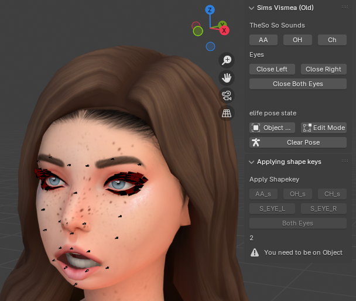
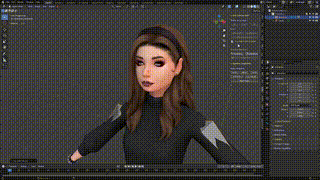

# BlenderVRchatVismeaCreater
 A fast way to create blendshape keys for your VRChat player models; using existing bones on the character mouth; right now
 only works with sims charcters (may work with others; but that's untested)

 
 

STILL VERY EARLY IN DEVELPMENT
right now it's working with sims chrarcters; and the ablity to choose what bone you want is disabled by comments in code
you can read the comments as it's still a bit a buggy miss

how to use (atm)
  select the armature
  go to pose mode
  click the face shape you want to pose your character into
  go to object mode
  click on body or the mesh
  then select the shape key that is the same name

if you wanted to change the values of how much a bone is rotating
then open the file with the name Oldbonetransfrom.py
and change it till you get what you need
-this will be not needed later down the line in time
